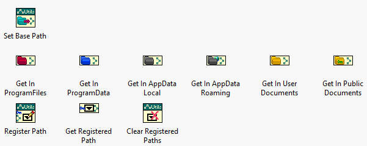

# Path-Utilities

Path utilities to provide some easy to use paths VIs.
eg: "C:\ProgramData\MyCompany\MyApplication"

## Palette Description

[See Antidoc Documentation](Antidoc-Output/Project-Documentation.html)